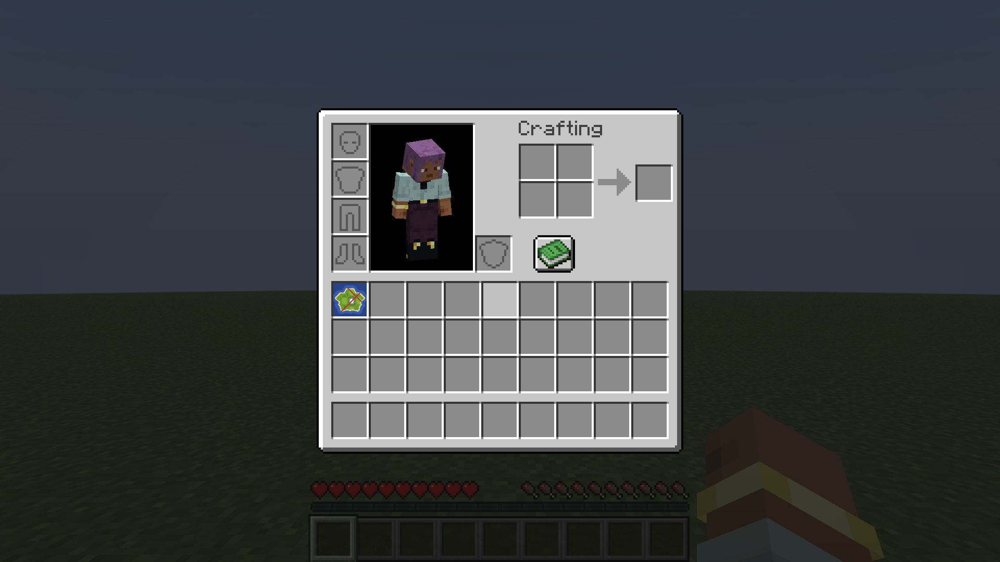

<div align="center">


**See what a filled map shows without putting it in your hand.**

[](https://modrinth.com/mod/show-my-maps)
[](#which-jar)
[](#the-server-half)
[](LICENSE)

</div>

Vanilla only draws a map's picture while you hold it. Everywhere else it is a blank roll of
parchment: in your inventory, in a chest, in an auction GUI, lying on the ground. This draws the
real thing instead.

---

## What it does



* **Map icons** — the slot shows the art in place of the parchment sprite, so a page full of map
  art reads at a glance, with no hovering.
* **Tooltip preview** — hover a map anywhere a tooltip appears — inventory, chest, hopper,
  creative menu, a shop GUI — and the picture renders under the normal lines.
* **Maps you never carried** — a chest full of art reads as art, not as a row of identical
  parchment.
* **Dropped maps** spin as the art itself instead of a rolled parchment.
* **Shulker box tooltip** — hover a box and its contents appear as a slot grid, maps included,
  replacing vanilla's list of item names. Steps aside automatically if you have
  [Shulker Box Tooltip](https://modrinth.com/mod/shulkerboxtooltip) installed.

---

## Install

Grab the jar from [Modrinth](https://modrinth.com/mod/show-my-maps) or the
[releases page](https://github.com/DragonX1901/show-my-maps/releases). It needs Fabric Loader and
Fabric API.

### Which jar

Match the version your **client** runs, not the server's.

| Jar | Covers |
| --- | --- |
| `+1.21.1` | 1.21, 1.21.1 |
| `+1.21.11` | 1.21.9, 1.21.10, 1.21.11 |
| `+26.1.2` | 26.1, 26.1.1, 26.1.2 |
| `+26.2` | 26.2 |
| `ShowMyMaps-Paper` | the **server plugin**, 1.21.1 through 26.2 — goes in `plugins/`, not `mods/` |

---

## Settings

Mod Menu opens the screen; the file is `config/show_my_maps.json`, written when the screen
closes. Vanilla widgets only, so the mod carries no config library.

| Field | Default | Meaning |
| --- | --- | --- |
| `slotPreview` | `true` | Draw map art in place of the item sprite |
| `slotPreviewSize` | `16` | Icon size in GUI pixels (8–16) |
| `tooltipEnabled` | `true` | Draw the picture in tooltips |
| `tooltipSize` | `128` | Tooltip preview size in GUI pixels (32–256) |
| `containerTooltip` | `true` | Show shulker box contents as a slot grid |
| `cacheMapData` | `true` | Keep received map colours on disk |
| `serverNotice` | `true` | Say so on joining a server that cannot send every map |

---

## The one thing to understand

Map pixels live on the server, and the client is only ever *given* them. Vanilla gives them in
exactly two cases:

- the map is in your own inventory — `ServerPlayer.doTick` calls `synchronizeSpecialItemUpdates`
  on each inventory slot;
- the map hangs in an item frame near you — `ServerEntity.sendChanges` pushes those to every
  tracking player.

That is the whole list. A map in a chest, in an auction page, inside a shulker box or on the
ground is **never sent to anybody**, and no client mod can draw pixels it was never given.
`ClientboundMapItemDataPacket` is one-way; there is no serverbound "send me map N".

So the mod has a server half, and the answer to "why is this listing still blank" is always which
half is missing.

| Where you are | What previews |
| --- | --- |
| Singleplayer or LAN | everything — you are running both halves |
| A server running a server half | everything |
| Any other server | maps you have carried or walked past in a frame, plus anything cached from those |

---

## The server half

Two of them, for the two kinds of server.

### Fabric servers

Drop the same jar in the server's `mods/`. `MapItemCarriedUpdateMixin` paints maps sitting in an
inventory rather than only in a hand, and `ContainerMapSync` pushes colours for maps in an open
container and for maps packed inside a carried shulker box.

| Field in `config/show_my_maps_server.json` | Default | Meaning |
| --- | --- | --- |
| `paintCarriedMaps` | `true` | Paint inventory maps, not only held ones |
| `carriedPaintInterval` | `4` | Ticks between painting passes |
| `syncContainerMaps` | `true` | Send colours for maps in an open container |
| `paintContainerMaps` | `true` | Paint those maps too |
| `containerSyncInterval` | `10` | Ticks between container passes |

### Paper, Spigot and their forks

These cannot load a Fabric mod at all, which is most public servers. `paper-plugin/` is the same
job as a Bukkit plugin: it sends map colours for maps in whatever inventory a player has open —
chests, auction and shop pages, any plugin GUI — plus shulker box and bundle contents, and maps
lying nearby.

One jar covers **1.21.1 through 26.2**, built against the oldest API in that range. Settings are
in `config.yml`; per-player scheduling keeps it correct on Folia and ShreddedPaper.

**Owners decide who gets previews.** Everyone holds `showmymaps.see` unless you take it away, so
a server selling map art can revoke it and grant it to a rank, or list worlds under
`disabled-worlds`. A player without it is never *sent* the colours, so there is nothing on their
client to reveal — the switch is server side, not a client setting anyone can flip back.

### Version handshake

Either half announces itself and its version to a joining client, so the mod can tell "this
server sends nothing" apart from "this server is behind", and say which. Anything older than
1.0.3 cannot announce itself and reads as absent. Update both halves together.

---

## Map cache

A server sends a map's colours once, and the client forgets them on disconnect or dimension
change. Every map that arrives is written to `show_my_maps_cache/<server>/map_<id>.bin` (16 KB
each) and read back when the server has not sent it this session. A map you have seen once —
carried, bought, or passed in an item frame — keeps previewing afterwards, including in a shop or
auction GUI that lists it later.

A network usually answers to several addresses, and the folder is named after the one you typed.
Joining through `play.example.com` today and `eu.example.com` tomorrow would otherwise split one
cache in two, so a map missing from the current folder is looked for in the folders of other
addresses on the same registrable domain, and copied across. Bare IPs are never grouped:
unrelated servers must not lend each other map ids.

This cannot conjure maps you have never been sent. Nothing can.

---

## Development

### Four jars, one source tree

[Stonecutter](https://stonecutter.kikugie.dev/) keeps the version differences in comment blocks
and builds each target from `versions/<game version>/`.

| Target | Notable differences |
| --- | --- |
| 1.21.1 | Older map renderer: `PoseStack` and `MultiBufferSource` |
| 1.21.11 | Render-state architecture; the version the tests run on |
| 26.1.2 | Unobfuscated game, Java 25, `GuiGraphics` renamed to `GuiGraphicsExtractor` |
| 26.2 | As above, plus the screen swap and HUD hide flag moved again |

The 1.21.11 jar covers three releases because Loom remaps to intermediary names, which do not
change across them, so the Mojmap rename of `ResourceLocation` to `Identifier` is a compile-time
detail only. Every mixin target exists with the same descriptor in all three, and the built jar
launches to the title screen on each with no mixin failures.

```bash
./gradlew ":1.21.1:build"                  # or 1.21.11, 26.1.2, 26.2
./gradlew build                            # all four
./gradlew -p paper-plugin build            # the Bukkit plugin
./gradlew "Set active project to 1.21.1"   # what the IDE and src/ follow
```

The 26.x targets need Gradle itself on Java 25, because their Loom alpha requires it:

```bash
JAVA_HOME=/path/to/jdk-25 ./gradlew ":26.2:build"
```

### Tests

`./gradlew :1.21.11:runClientGameTest` drives a real client: it builds a world, paints map art,
and checks the previews render in slots, tooltips, chests, shulker boxes and on the ground. The
client gametest API only exists from 1.21.9 on, so these run on 1.21.11 against the shared code
all four jars compile.

To try the server halves against a real server, `paper-plugin/stub-auction/` stands in for the
auction plugins a public network runs: it opens a GUI holding a filled map the player never
carried, which is exactly the case nothing sends colours for.

```bash
./gradlew -p paper-plugin/stub-auction build   # the fake auction house
./gradlew -p paper-plugin build                # the real plugin
./gradlew :1.21.11:runClient -Ptest_server=127.0.0.1:25565
```

The client joins on start up and the GUI opens itself, so nothing needs driving by hand. Without
`ShowMyMaps-Paper` in `plugins/` the listing is blank parchment and no file appears under
`run/show_my_maps_cache/`; with it the art draws and the file is written. That pair is the whole
claim, and it is worth rerunning rather than believing.

### Logo

`logo.png` is half vanilla, half this mod: the left side is Minecraft's own `filled_map` sprite —
a blank parchment, all you get without the mod — and the right side is the same map rendered by
it. `LogoShotTest` regenerates the right half.

---

## License

MIT, see [LICENSE](LICENSE).
